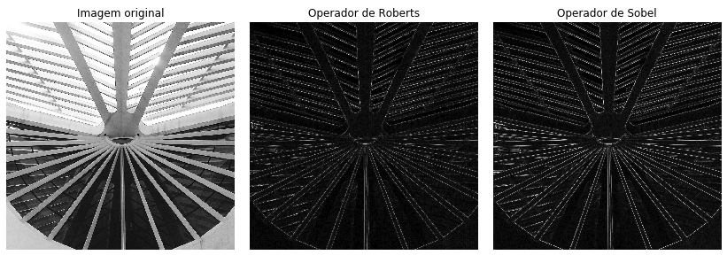

# Processamento de Imagem em Python

O **Processamento de imagens** (Image Processing) apresentam técnicas para manipular informações representadas na imagem como por exemplo, realçar bordas e remover ruídos.[1]  
No campo da **Visão Computacional** (Computer Vision), técnicas de processamento de imagem são aplicadas para inferir informações de baixo nível em partes da imagem.  
Os algoritmos de **visão computacional** tem como entrada uma ou mais imagens digitais que são pré-processadas por meio de técnicas de processamento de imagem para que informações úteis possam ser extraídas.  
Existem inumeras bibliotecas disponíveis para auxiliar no processamento de imagens como o [OpenCV](https://opencv.org/).  
Para os exemplos apresentados foi usada a biblioteca [scikit-image[2]](https://scikit-image.org/) que é uma coleção de algoritmos para processamento de imagens. Está disponível gratuitamente e sem restrições. 

## Aplicações


## Requisitos
```
$ pip install -U scikit-image
```  

## Detecção de borda (Edge Detection)

A detecção de bordas é uma das operações mais usadas no processamento de imagens, e provavelmente há mais algoritmos na literatura para melhorar e detectar bordas do que qualquer outro assunto em particular. A razão para isso é que as arestas formam o contorno de um objeto, no sentido genérico. Objetos são assuntos de interesse em análise de imagens e no campo da visão computacional.[3]  

[](https://scontent.fmao1-1.fna.fbcdn.net/v/t1.0-9/13263687_2041642749394064_8302628300458166040_n.jpg?_nc_cat=0&oh=3d272cf66b8468e7d80bb20b0fafa5c0&oe=5C016476)  
Foto: Juiana Rosa

Uma borda é a fronteira entre duas regiões de níveis de cinza diferentes. Para a detecção e realce de bordas, é aplicado o filtro por derivada utilizando-se máscaras de convolução, também chamadas de operadores de 2x2 ou de 3x3.[4]  
Alguns exemplos destas máscaras que estão presentes no scikit-image são os operadores de [Roberts](https://en.wikipedia.org/wiki/Roberts_cross), Prewitt, Sobel e Scharr.
Os detectores de bordas (Roberts, Prewitt, Sobel e Scharr) são conhecidos também como filtros por derivadas, pois é o método mais comum de diferenciação utilizado em processamento de imagem.[5]  
Existem dois operadores gradiente fundamentais de Primeira Ordem (ou detetores de borda diferenciadores de primeira ordem). Um método envolve a geração de gradientes em duas direções ortogonais na imagem enquanto o outro método utiliza um conjunto de derivadas direcionais.[6]  


## Citação

> [1] BARELLI, Felipe. **Introdução à Visão Computacional: Uma abordagem prática com Python e OpenCV**. Casa do Código, 2018.

> [2] Stéfan van der Walt, Johannes L. Schönberger, Juan Nunez-Iglesias, François Boulogne, Joshua D. Warner, Neil Yager, Emmanuelle Gouillart, Tony Yu and the scikit-image contributors. **scikit-image: Image processing in Python**. PeerJ 2:e453 (2014) http://dx.doi.org/10.7717/peerj.453

> [3] PARKER, J.R. **Algorithms for Image Processing and Computer Vision**. Wiley Publishing, 2011.

> [4] MATURAnA, Patrícia. **ALGORITMOS DE DETECÇÃO DE BORDAS IMPLEMENTADOS EM FPGA**. FACULDADE DE ENGENHARIA DE ILHA SOLTEIRA, 2010.

> [5] SILVA, F.J.V., ALVES, C.H.F. **APLICAÇÃO DE TÉCNICAS DE PROCESSAMENTO DE IMAGENS DIGITAIS EM IMAGENS GERADAS POR ULTRA-SOM**. Universidade Federal do Rio Grande do Norte, 2008.

> [6] BRITO, Sérgio. **Relatorio Final de Iniciação Científica Sistemas de Processamento Digital de Imagens para Fins Didático/Cientíco - Estudo	 Seleção e Implementação de Algoritmos de Segmentação.** Universidade Federal da Paraíba, 1998.

